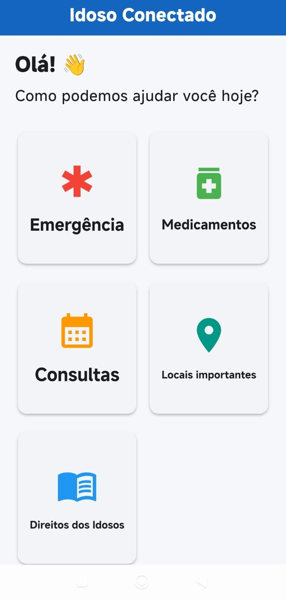
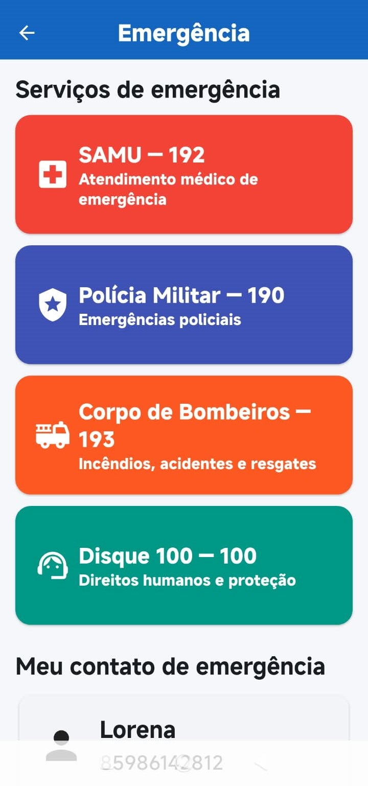
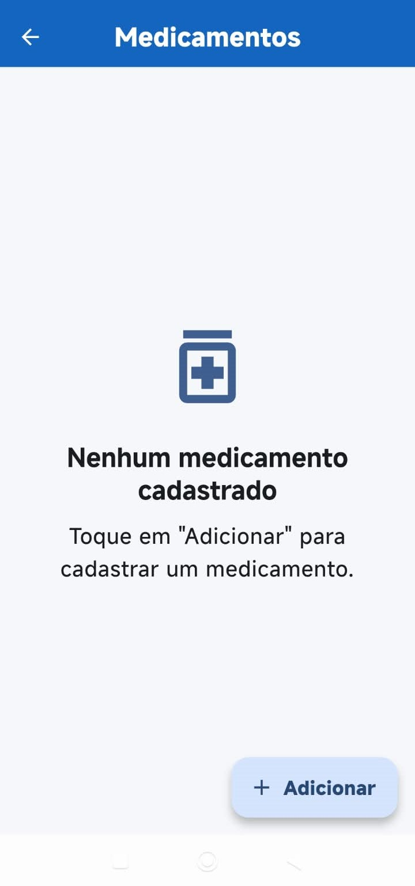
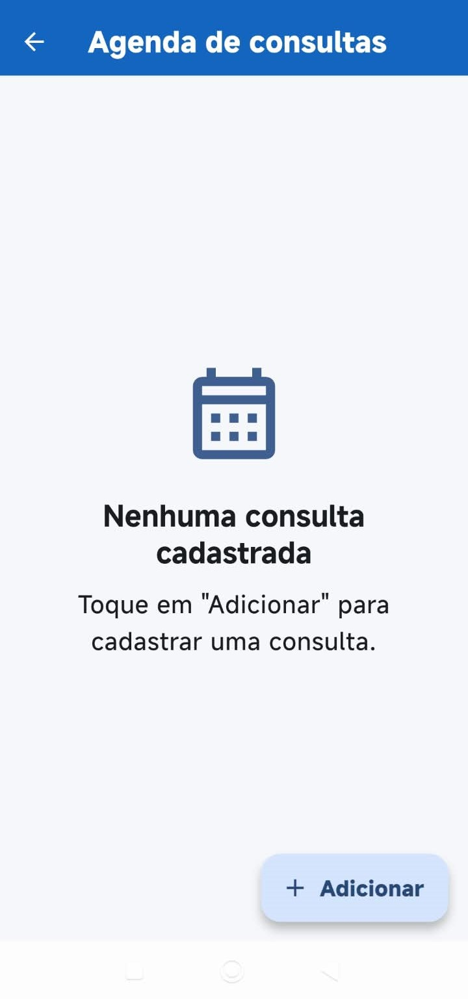
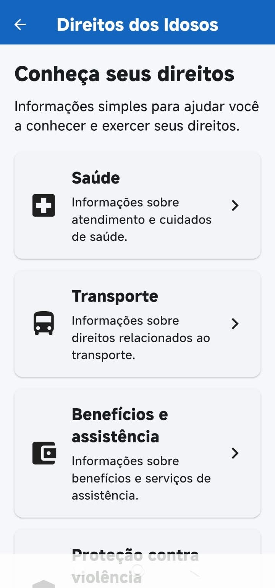
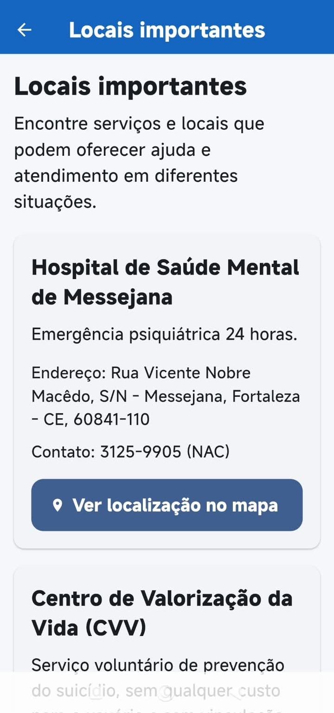
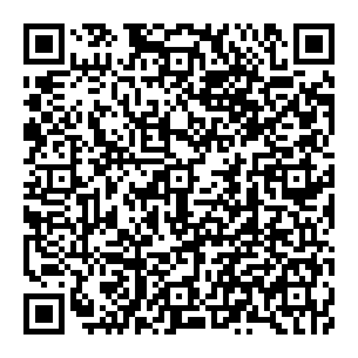

# 📱 Idoso Conectado

> Aplicativo mobile desenvolvido para facilitar o acesso de pessoas idosas a recursos de emergência, saúde, organização pessoal e informações sobre seus direitos.

## 🎯 Objetivo

O **Idoso Conectado** foi desenvolvido com foco em acessibilidade e facilidade de uso, reunindo em um único aplicativo recursos que podem auxiliar pessoas idosas no dia a dia.

A proposta é oferecer uma interface simples, com textos maiores, botões amplos, navegação objetiva e suporte ao **TalkBack**.

## ✨ Principais funcionalidades

- 🚨 Emergência: SAMU 192, Polícia Militar 190, Bombeiros 193, Disque 100, contato de emergência e compartilhamento de localização.
- 💊 Medicamentos: cadastro, dosagem, horários, frequência e lembretes por notificação.
- 📅 Agenda de consultas: cadastro de consultas e lembretes com antecedência.
- 📖 Direitos dos Idosos: saúde, transporte, benefícios, proteção contra violência, moradia e família.
- 🏥 Informações de saúde: saúde mental, SUS, medicamentos, visão e audição, alimentação e atividade física.
- 📍 Locais importantes: serviços de atendimento, contatos, horários e localização no mapa.

## ♿ Acessibilidade

- Textos ampliados
- Botões grandes e fáceis de tocar
- Contraste visual adequado
- Navegação simplificada
- Linguagem clara
- Rótulos para leitores de tela
- Suporte ao **TalkBack**
- Componentes semânticos para acessibilidade

## 📸 Demonstração

<p align="center">
  
</p>

### 🚨 Emergência

<p align="center">
  
</p>

### 💊 Medicamentos

<p align="center">
  
</p>

### 📅 Agenda de consultas

<p align="center">
  
</p>

### 📖 Direitos dos Idosos

<p align="center">
  
</p>

### 📍 Locais importantes

<p align="center">
  
</p>

## 🛠️ Tecnologias utilizadas

- Flutter
- Dart
- Material 3
- SharedPreferences
- flutter_local_notifications
- flutter_timezone
- timezone
- url_launcher
- geolocator
- share_plus

## 📂 Estrutura do projeto

```text
lib/
├── app/
├── models/
├── screens/
│   ├── consultations/
│   ├── emergency/
│   ├── home/
│   ├── medications/
│   └── rights/
├── services/
└── main.dart
```

## 📥 Download

### Idoso Conectado v1.0.0

[⬇️ Baixar a Release v1.0.0](https://github.com/Daggorhorn/Idoso_Conectado/releases/tag/v1.0.0)

[📦 Baixar app-release.apk diretamente](https://github.com/Daggorhorn/Idoso_Conectado/releases/download/v1.0.0/app-release.apk)

> APK de aproximadamente 53,2 MB.

### 📱 Instalação por QR Code

<p align="center">
  
</p>

## ▶️ Como executar

```bash
git clone https://github.com/Daggorhorn/Idoso_Conectado.git
cd Idoso_Conectado
flutter pub get
flutter run
```

Para gerar o APK:

```bash
flutter build apk --release
```

## 🧪 Validação

A versão `v1.0.0` foi validada em dispositivo Android físico, incluindo navegação, TalkBack, medicamentos, notificações, consultas, emergência, contato de emergência, localização, direitos, saúde e locais importantes.

```text
flutter analyze
No issues found!
```

## 🎓 Contexto acadêmico

Projeto desenvolvido durante a formação em **Análise e Desenvolvimento de Sistemas**, aplicando desenvolvimento mobile, acessibilidade, persistência de dados, notificações e integração com recursos do dispositivo.

## 👨‍💻 Autor

**Igor Gabriel Martins**

Estudante de Análise e Desenvolvimento de Sistemas.

- GitHub: [Daggorhorn](https://github.com/Daggorhorn)
- LinkedIn: [Igor Gabriel Martins](https://linkedin.com/in/igor-gabriel-b8760b366)

---

<p align="center">
  Desenvolvido com Flutter 💙
</p>
